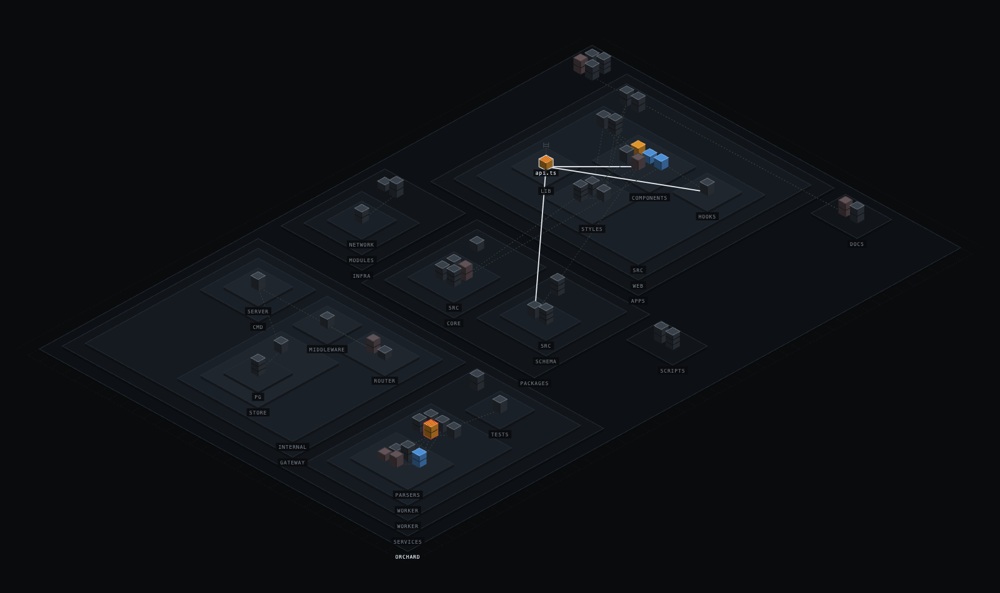

# CodeCity

**A visual trust layer for AI coding agents.** Your repo is a city. Files are
buildings, imports are roads, and everything the agent does is a visible event
happening to a building — live, while it works.



```sh
cd /path/to/your/project
npx codecity init     # writes the hook into .claude/settings.local.json
npx codecity          # scans, serves, opens the browser
```

Restart Claude Code after `init` so it picks up the hook, then work normally.

---

## Why

Agents now make dozens of edits per session, and reading every diff is slower than
producing them. So people click "Always Allow" and stop looking. The usual answer is
to bolt on a scanner afterwards — but a scanner tells you what's wrong with the
result, never what the agent was *doing*.

CodeCity is the other half. It shows the session as it happens, in a form you can
parse in one glance:

- **Which parts of the codebase has it actually been in?** Untouched files are still
  drawn, so the ratio of touched to untouched is visible before anything happens.
- **What's sitting in my review queue?** Changed files are amber. Nothing else in the
  interface is coloured, so colour always means the agent.
- **What else does this touch?** Selecting a file lights its import edges and lists
  both directions — real graph data, not a guess.

Two properties make this cheap enough to leave running:

**The renderer is deterministic code.** Hand-written Canvas 2D, redrawn locally. No
model is in the draw loop, so frames cost nothing and the picture cannot hallucinate
a change that didn't happen.

**Risk is a rule, never a judgment.** Two heuristics run over the event log —
*unreviewed churn* (two writes with no read between) and *burst* (three writes to one
file inside two minutes). The model is never asked "is this risky." That's a solved
problem with rules.

The governing constraint is **understanding per token, not pixels per token**.

## Reading the city

The city is an architect's massing model: every file is a solid volume whether or not
the agent has been near it.

**Shape answers "how big is this, and where does it sit?"**

| Form | Meaning |
|---|---|
| Height | Line count, square-rooted so one huge file can't hide a district |
| Storey bands | One band per 30 lines — compare two neighbours by counting |
| Terrace elevation | Depth in the tree: `src/api/routes` stands a step above `src/api` |
| Plate footprint | A directory. Nested plates are nested directories, at every level |

**Fill answers "should I be looking at this?"** It tracks the agent's *attention*, not
its tool calls.

| Fill | Meaning |
|---|---|
| Graphite | Untouched this session |
| Green | Read, still in the agent's context |
| Green → grey → red | Cooling over five minutes; red means it's working from memory |
| Amber | Changed by the agent — your review queue |
| Blue | New ground: a file the agent created |
| Red hatch | A risk heuristic fired |

**The glyph on the leader line answers "what did it just do?"** One mark per tool
class, so every visual state traces back to exactly one kind of event: crane =
`Write`, scaffolding = `Edit`, loupe = `Read`, tick = tests/lint, hard hat = `Bash` or
`Task`, drill = MCP call, truck = `WebFetch`.

Keeping fill and glyph apart is what lets colour carry a trust signal while the
metaphor stays 1:1 with real events.

**Controls** — drag to pan, scroll to zoom, click a building or walk with `↑`/`↓`,
`⏎` for blast radius, `esc` to clear. The left index is the directory tree; clicking a
row isolates that district and everything nested inside it.

## How it works

```
Claude Code
  │  PostToolUse hook  (a one-line curl, ~16ms, always exits 0)
  ▼
POST /codecity/event ──► normalize (src/schema.js) ──► append-only session log
  │
  ▼
State graph (src/state.js)     files → buildings, imports → roads, tool → state
  │
  ▼  SSE
Deterministic Canvas renderer (public/city.js)
```

The hook has to survive running after *every* tool call, so it is a bare `curl` rather
than a Node script — 16ms against ~76ms of interpreter startup — and it swallows its
exit code. A CodeCity that simply isn't running must never put an error in front of
you once per tool call.

Events append to `.codecity/session-<timestamp>.jsonl` in the watched project, and the
newest log replays on startup, so restarting doesn't lose the city.

### Roads

Roads are resolved statically, per language, over an index of the repo — not by
regex-matching paths and hoping. Relative specifiers, package-manifest aliases
(`package.json`, `tsconfig`/`jsconfig` paths, `go.mod`, `Cargo.toml`, `pyproject.toml`,
`composer.json`), and language-specific namespacing are all handled, across JS/TS,
Python, notebooks, Go, Rust, JVM, .NET, Ruby, PHP, C/C++, Swift, Dart, Lua, Elixir,
Erlang, Haskell, protobuf, CSS, HTML, shell and Terraform.

Two rules keep it honest:

- **Ambiguity resolves to nothing.** If `shared/util` could be two files, it draws no
  road. A road that isn't real is worse than a road that's missing.
- **Roads die with their imports.** Deleting an import removes its road on the next
  write, not at the next full scan.

Imports that don't resolve locally are reported as third-party dependencies instead —
and a path that merely *failed* to resolve is reported as neither.

### Wiring a different agent

`src/schema.js` is the only file that knows what an agent's payload looks like.
`POST /codecity/event` accepts three dialects and normalizes all of them:

```jsonc
{ "tool_name": "Edit", "tool_input": { … }, "cwd": "…" }  // Claude Code hooks
{ "name": "Edit", "arguments": "{ … }", "cwd": "…" }      // OpenAI-style function calls
{ "tool": "Edit", "input": { … }, "cwd": "…" }            // already normalized
```

Adding a second agentic tool is a hook line plus, at most, an entry in `adapt()` — not
a change to the state graph or the renderer.

## CLI

| Command | Purpose |
|---|---|
| `codecity` | Scan, serve, open the browser |
| `codecity init` | Write the `PostToolUse` hook |
| `codecity uninstall` | Remove it again |

| Flag | Default | Purpose |
|---|---|---|
| `--port` | `4317` | Local server port. Must match what `init` wrote. |
| `--root` | cwd | Project to visualise. |
| `--max-files` | `400` | Building cap for large repos. |
| `--shared` | off | Write the hook to `settings.json` (committed) instead of `settings.local.json`. |
| `--no-open` | off | Don't launch a browser. |
| `--fresh` | off | Ignore the previous session log instead of replaying it. |

`npm test` runs the suite. It covers hook installation and the import graph; the
renderer is checked by eye.

## Platform support

Node >= 20, plus `curl` — which macOS, Linux and Windows 10 1803+ all ship.

The hook is a shell string in `settings.json`, and Claude Code runs it with a
different shell per platform, so `init` writes a different command per platform.
Windows is the interesting case: Claude Code uses Git Bash when it's installed and
PowerShell when it isn't, and install time can't tell which — so the Windows command
is written to be valid in both. That means `curl.exe` rather than `curl` (in
PowerShell 5.1 `curl` is an alias for `Invoke-WebRequest`) and a trailing `exit 0`
rather than `|| true` (PowerShell 5.1 has no `||`).

One consequence: with `--shared` the hook is committed, and a hook written on macOS
won't fire on Windows. CodeCity detects this on startup and tells you to re-run `init`
rather than leaving you with a city that quietly never moves.

## What it doesn't do

- **Short roads hide under buildings.** Roads connect building centres, so an edge
  between two files in the same directory is largely occluded. Cross-district coupling
  — the kind worth seeing — reads fine.
- **Off-site calls stay off-site.** A `WebFetch` has no building to land on, so it only
  reaches the ticker. `Bash` and MCP calls do land, but only when the target file's
  path appears in the command.
- **The explain panel is parked.** The one place a model was ever invoked is currently
  commented out. Everything above is local, deterministic and free.

---

See [ROADMAP.md](ROADMAP.md) for the V1 → V4 progression.
